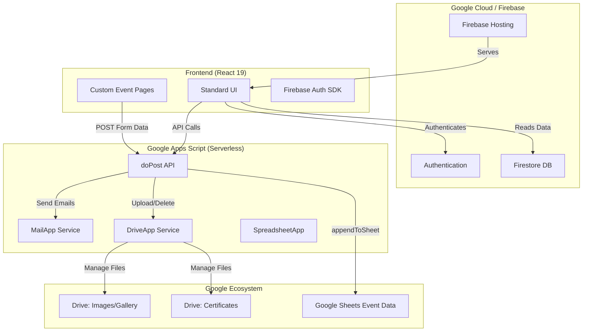

# IEEE <NAME> Student Branch Platform

A modern, full-featured web platform for the IEEE <NAME> Student Branch, built with React, Firebase, and Google Apps Script.


## 🌟 Features

### Public Features

- **📰 Blog System**: Rich markdown blog posts with syntax highlighting, math equations (KaTeX), and author profiles
- **📅 Event Calendar**: Interactive calendar view and list view for upcoming events with registration capabilities
- **🖼️ Media Gallery**: Photo galleries for past events, powered by Google Drive integration
- **📄 Research Papers**: Browse and download academic papers and research publications
- **🎓 Certificate Verification**: Verify and download official IEEE certificates with automated PDF generation
- **👥 Panel Information**: Meet the current executive committee and branch counselors
- **🔒 Private Events**: Email-based access control for exclusive events
- **🌓 Dark Mode**: System-aware dark/light theme with smooth transitions

### Admin Features

- **📊 Analytics Dashboard**: Real-time insights with engagement charts and statistics
- **✍️ Content Management**:
  - Blog post creation with markdown editor
  - Event management with cover images and registration forms
  - Paper uploads with metadata
  - Panel member management
- **📧 Mail Center**:
  - Gmail inbox integration
  - Advanced email composer with templates
  - Automated welcome emails and confirmation emails
- **💬 Contact Manager**: Centralized management of contact information (address, email, phone, social links)
- **🎫 Certificate Generator**: Upload and manage certificates with Google Drive integration
- **👤 User Management**: Role-based access control (Admin, Moderator, Member)
- **⚙️ Settings**: Configure Google Apps Script URLs, Drive folders, and system preferences
- **🔐 Session Management**: Automatic timeout with configurable duration

### Advanced Features

- **Automated PDF Certificates**: Generate professional, branded certificates on-the-fly
- **Event Privacy System**: Public/private events with email-based access gates
- **Multi-view Event Display**: Toggle between list and calendar views
- **Optimized Performance**: Code splitting, lazy loading, and production-ready builds
- **Responsive Design**: Mobile-first approach with Tailwind CSS
- **SEO Optimized**: Proper meta tags and semantic HTML

## 🛠️ Tech Stack

### Frontend

- **React 19** - UI framework
- **Vite** - Build tool and dev server
- **Tailwind CSS 4** - Utility-first styling
- **React Router** - Client-side routing
- **Framer Motion** - Animations
- **Lucide React** - Icon library
- **Recharts** - Analytics charts
- **React Markdown** - Blog content rendering
- **jsPDF + html2canvas** - PDF generation

### Backend & Services

- **Firebase Authentication** - User authentication
- **Firestore** - NoSQL database
- **Firebase Hosting** - Static site hosting
- **Google Apps Script** - Backend API for file uploads, emails, and Drive operations
- **Google Drive** - File storage for images, certificates, and documents

## 🏗️ System Architecture



## 📋 Prerequisites

- Node.js 18+ and npm
- Firebase account and project
- Google Cloud Platform account (for Apps Script)
- Google Drive folders for file storage
- Gmail account (for email features)

## 🎨 Customizing This Template

This is a **generic template** designed for any IEEE Student Branch. Before deploying, you need to customize it for your institution:

### 1. Replace Institution Name

The template uses `<NAME>` as a placeholder throughout the codebase. Replace it with your institution name:

```bash
# Replace <NAME> with your institution name (e.g., "MIT", "Stanford", "Oxford")
find . -type f \( -name "*.jsx" -name "*.js" -name "*.html" -name "*.md" \) -exec sed -i 's/<NAME>/YOUR_INSTITUTION_NAME/g' {} +
```

**Example:**

```bash
# For MIT
find . -type f \( -name "*.jsx" -name "*.js" -name "*.html" -name "*.md" \) -exec sed -i 's/<NAME>/MIT/g' {} +
```

### 2. Update Contact Information

After deployment, configure contact details via the admin panel:

1. Go to **Admin Panel → Contact**
2. Fill in:
   - Page heading and description
   - Institution address and Google Maps link
   - Email and phone number
   - Social media links (Facebook, LinkedIn)
3. Click **Save Changes**

This will update both the Contact page and Footer across the site.

### 3. Update Backend Configuration

Edit `backend_scripts/Code.gs`:

```javascript
// Update these values
const ADMIN_EMAIL = "your-admin@email.com"; // Line 12

// Update email template footer (lines 309-311)
// Replace "Your Institution Address" with actual address
// Replace "your-website-url.com" with your domain
```

### 4. Update Email Templates

Edit files in `email_templates/`:

- `welcome_email.html`
- `confirmation_email.html`

Replace placeholder text with your institution details.

## 🚀 Quick Start

### 1. Clone the Repository

```bash
git clone https://github.com/muhammadabdullah007git/ieee-baust-sb.git
cd ieee-baust-sb
```

### 2. Install Dependencies

```bash
npm install
```

### 3. Configure Environment Variables

Create a `.env` file in the root directory:

```env
# Firebase Configuration
VITE_FIREBASE_API_KEY=your_api_key
VITE_FIREBASE_AUTH_DOMAIN=your_project.firebaseapp.com
VITE_FIREBASE_PROJECT_ID=your_project_id
VITE_FIREBASE_STORAGE_BUCKET=your_project.appspot.com
VITE_FIREBASE_MESSAGING_SENDER_ID=your_sender_id
VITE_FIREBASE_APP_ID=your_app_id

# Session Configuration
VITE_ADMIN_SESSION_TIMEOUT=1800000  # 30 minutes in milliseconds
```

### 4. Set Up Firebase

#### Initialize Firebase

```bash
npm install -g firebase-tools
firebase login
firebase init
```

Select:

- **Hosting**: Configure files for Firebase Hosting
- **Firestore**: Set up Firestore database

#### Configure Firestore Rules

Update `firestore.rules`:

```javascript
rules_version = '2';
service cloud.firestore {
  match /databases/{database}/documents {
    // Public read access
    match /events/{document=**} {
      allow read: if true;
      allow write: if request.auth != null;
    }
    
    match /blogs/{document=**} {
      allow read: if true;
      allow write: if request.auth != null;
    }
    
    match /papers/{document=**} {
      allow read: if true;
      allow write: if request.auth != null;
    }
    
    match /certificates/{document=**} {
      allow read: if true;
      allow write: if request.auth != null;
    }
    
    match /panel/{document=**} {
      allow read: if true;
      allow write: if request.auth != null;
    }
    
    // User profiles - users can read their own, admins can read all
    match /users/{userId} {
      allow read: if request.auth != null;
      allow write: if request.auth.uid == userId;
    }
    
    // Settings - admin only
    match /settings/{document=**} {
      allow read: if request.auth != null;
      allow write: if request.auth != null;
    }
  }
}
```

#### Configure Authentication

1. Go to Firebase Console → Authentication
2. Enable **Email/Password** sign-in method
3. Add authorized domains for password reset:
   - `localhost` (for development)
   - Your production domain (e.g., `ieee-baust-sb.web.app`)
   - Your custom domain (if applicable)

### 5. Set Up Google Apps Script Backend

#### Create Apps Script Project

1. Go to [script.google.com](https://script.google.com)
2. Create a new project
3. Copy the contents of `backend_scripts/Code.gs` into the script editor

#### Configure Drive Folders

Create the following folders in Google Drive and note their IDs:

- Events (for event cover images)
- Certificates (for certificate PDFs)
- Blogs (for blog cover images)
- Panel (for member photos)
- Users (for user avatars)
- Papers (for research papers)

Update the folder IDs in `Code.gs`:

```javascript
const FOLDER_ID_EVENTS = "your_events_folder_id";
const FOLDER_ID_PAPERS = "your_papers_folder_id";
const FOLDER_ID_CERTIFICATES = "your_certificates_folder_id";
const FOLDER_ID_BLOGS = "your_blogs_folder_id";
const FOLDER_ID_PANEL = "your_panel_folder_id";
const FOLDER_ID_USERS = "your_users_folder_id";
const ADMIN_EMAIL = "sb.ieee@baiust.edu.bd";
```

#### Create Apps Script Spreadsheet

1. Create a new Google Spreadsheet
2. Tools → Script editor
3. Paste the `Code.gs` content
4. Deploy as Web App:
   - Click **Deploy** → **New deployment**
   - Type: **Web app**
   - Execute as: **Me**
   - Who has access: **Anyone**
   - Copy the deployment URL

#### Configure in Firestore

Add a document in Firestore at `settings/gas_config`:

```json
{
  "gas_url": "your_main_gas_deployment_url",
  "gas_url_features": "your_features_gas_url",
  "gas_url_mail": "your_mail_gas_url",
  "folder_id_events": "your_events_folder_id",
  "folder_id_papers": "your_papers_folder_id",
  "folder_id_certificates": "your_certificates_folder_id",
  "folder_id_blogs": "your_blogs_folder_id",
  "folder_id_panel": "your_panel_folder_id",
  "folder_id_avatars": "your_users_folder_id"
}
```

### 6. Create First Admin User

1. Run the development server: `npm run dev`
2. Navigate to `/signup`
3. Create an account
4. In Firestore, update the user document:

   ```json
   {
     "role": "Admin",
     "status": "Teacher"
   }
   ```

### 7. Run Development Server

```bash
npm run dev
```

Visit `http://localhost:5173`

## 📦 Deployment

### Option 1: Firebase Hosting (Recommended)

#### Build and Deploy

```bash
npm run build
npm run deploy
```

Or use the combined command:

```bash
firebase deploy --only hosting
```

#### Custom Domain

1. Go to Firebase Console → Hosting
2. Click "Add custom domain"
3. Follow the DNS configuration steps

### Option 2: Render (Static Site)

#### Using render.yaml (Automated)

The repository includes a `render.yaml` file for automated deployment:

1. Push to GitHub:

```bash
git add .
git commit -m "Deploy to Render"
git push origin main
```

1. In Render Dashboard:
   - Click **New** → **Blueprint**
   - Connect your GitHub repository
   - Render will automatically detect `render.yaml`

#### Manual Setup

1. Go to [Render Dashboard](https://dashboard.render.com)
2. Click **New** → **Static Site**
3. Connect your GitHub repository
4. Configure:
   - **Name**: `ieee-baust-sb`
   - **Build Command**: `npm run build`
   - **Publish Directory**: `dist`
5. Add environment variables from your `.env` file
6. Configure Redirects:
   - **Source**: `/*`
   - **Destination**: `/index.html`
   - **Action**: Rewrite (200)

## ⚙️ Configuration

### Environment Variables

| Variable                            | Description                              | Required |
| ----------------------------------- | ---------------------------------------- | -------- |
| `VITE_FIREBASE_API_KEY`             | Firebase API key                         | Yes      |
| `VITE_FIREBASE_AUTH_DOMAIN`         | Firebase auth domain                     | Yes      |
| `VITE_FIREBASE_PROJECT_ID`          | Firebase project ID                      | Yes      |
| `VITE_FIREBASE_STORAGE_BUCKET`      | Firebase storage bucket                  | Yes      |
| `VITE_FIREBASE_MESSAGING_SENDER_ID` | Firebase messaging sender ID             | Yes      |
| `VITE_FIREBASE_APP_ID`              | Firebase app ID                          | Yes      |
| `VITE_ADMIN_SESSION_TIMEOUT`        | Session timeout in ms (default: 1800000) | No       |

### GAS Backend Collections

- **users**: User profiles and authentication data
- **events**: Event information and metadata
- **blogs**: Blog posts with markdown content
- **papers**: Research papers and publications
- **certificates**: Certificate records
- **panel**: Executive committee members
- **settings**: System configuration

### Google Apps Script Actions

The backend supports the following actions:

- `register_event`: Handle event registrations
- `send_email`: Send custom emails
- `send_welcome_email`: Automated welcome emails
- `list_files`: List files in Drive folders
- `upload_file`: Upload files to Drive
- `delete_file`: Delete files from Drive
- `save_blog_content`: Save blog markdown
- `get_blog_content`: Retrieve blog content
- `get_blog_list`: List all blogs
- `delete_blog_content`: Delete blog content
- `get_inbox`: Fetch Gmail inbox threads

## 📖 Usage Guide

### Admin Panel

Access the admin panel at `/admin/login`

#### Event Management

1. Navigate to **Events** in the sidebar
2. Click **Create Event**
3. Fill in event details:
   - Title, dates, location
   - Cover image (uploaded to Drive)
   - Event type (Workshop, Seminar, Competition, etc.)
   - Registration form ID or custom URL
   - **Custom Event Page** (optional): Write custom HTML/CSS/JS code for unique event pages
   - Gallery folder ID (for photo galleries)
   - Privacy settings
4. Click **Save**

##### Custom Event Pages with Google Sheets Integration

The platform supports creating custom event pages using HTML, CSS, and JavaScript. This is useful for events that need unique layouts, interactive features, or custom registration forms.

**Requirements for Google Sheets Integration:**

If your custom event page needs to collect registration data and store it in Google Sheets:

1. **Create a Google Sheet**:
   - Create a new Google Sheet for your event
   - Set up column headers (e.g., Name, Email, Phone, etc.)
   - Note the Sheet ID from the URL

2. **Update Google Apps Script**:
   - Open your GAS project (`backend_scripts/Code.gs`)
   - Add a new action handler for your event (e.g., `register_custom_event`)
   - Use the `appendToSheet` function to save data
   - Example:

     ```javascript
     if (action === 'register_my_event') {
       const sheetId = 'YOUR_SHEET_ID';
       const data = [name, email, phone, /* other fields */];
       appendToSheet(sheetId, 'Sheet1', data);
       return ContentService.createTextOutput(JSON.stringify({success: true}));
     }
     ```

3. **Deploy GAS and Update Settings**:
   - Deploy your updated GAS as a new version
   - Copy the deployment URL
   - Update in Admin → Settings → GAS URLs
4. **Create a Google Sheet**:
    - Create a new Google Sheet for your event
    - Set up column headers (e.g., Name, Email, Phone, etc.)
    - Note the Sheet ID from the URL

5. **Update Google Apps Script**:
    - Open your GAS project (`backend_scripts/Code.gs`)
    - Add a new action handler for your event (e.g., `register_custom_event`)
    - Use the `appendToSheet` function to save data
    - Example:

        ```javascript
        if (action === 'register_my_event') {
          const sheetId = 'YOUR_SHEET_ID';
          const data = [name, email, phone, /* other fields */];
          appendToSheet(sheetId, 'Sheet1', data);
          return ContentService.createTextOutput(JSON.stringify({success: true}));
        }
        ```

6. **Deploy GAS and Update Settings**:
    - Deploy your updated GAS as a new version
    - Copy the deployment URL
    - Update in Admin → Settings → GAS URLs

7. **Write Custom Event Code**:
    - In Event Manager, use the "Custom Event Page" field
    - Write your HTML/CSS/JS code
    - Use `fetch()` to call your GAS endpoint:

        ```javascript
        const GAS_URL = 'YOUR_GAS_DEPLOYMENT_URL';
        
        // Option 1: JSON (if CORS is properly configured)
        fetch(GAS_URL, {
          method: 'POST',
          body: JSON.stringify({
            action: 'register_my_event',
            name: formData.name,
            email: formData.email,
            // ... other fields
          })
        });
        
        // Option 2: URLSearchParams (more reliable for GAS, avoids CORS preflight)
        const payload = new URLSearchParams({
          action: 'register_my_event',
          data: JSON.stringify(formData)
        });
        
        fetch(GAS_URL, {
          method: 'POST',
          body: payload
        }).then(response => response.json())
          .then(data => console.log('Success:', data));
        ```

8. **Test Your Integration**:
    - Save the event and visit the event page
    - Submit a test registration
    - Verify data appears in your Google Sheet

**Important Notes**:

- Custom event pages are rendered in an iframe for security
- The GAS URL must be accessible (deployed as web app)
- Ensure proper CORS configuration in GAS
- Test thoroughly before making the event public

#### Creating Blog Posts

1. Navigate to **Blogs**
2. Click **Create Post**
3. Write content in Markdown
4. Add cover image, category, and tags
5. Publish or save as draft

#### Certificate Management

1. Navigate to **Certificates**
2. Upload certificate PDF to Drive
3. Enter student name, event name, and reference number
4. The system generates a verification URL

#### Email Features

- **Inbox**: View recent Gmail messages
- **Compose**: Send emails with templates
- **Automated**: Welcome emails sent on signup
- **Confirmations**: Event registration confirmations

### Using Public Features

#### Event Registration

1. Browse events at `/events`
2. Click on an event
3. For public events: Click "Register" or "Start"
4. For private events: Enter allowed email for access

#### Certificate Verification

1. Visit `/certificate`
2. Enter certificate reference number
3. View certificate details
4. Download official PDF

#### Media Gallery

1. Visit `/gallery`
2. Browse event photo collections
3. Click on an event to view full gallery
4. Use lightbox for full-screen viewing

## 🔧 Development

### Project Structure

```text
ieee-baust-sb/
├── src/
│   ├── components/      # Reusable components
│   │   ├── auth/       # Authentication components
│   │   ├── blog/       # Blog-related components
│   │   ├── certificate/ # Certificate components
│   │   ├── event/      # Event components
│   │   └── shared/     # Shared UI components
│   ├── context/        # React Context providers
│   ├── layouts/        # Layout components
│   ├── lib/           # Utilities and helpers
│   ├── pages/         # Page components
│   │   ├── admin/     # Admin pages
│   │   └── public/    # Public pages
│   ├── services/      # API services
│   └── App.jsx        # Main app component
├── backend_scripts/   # Google Apps Script
├── public/           # Static assets
├── .env              # Environment variables
├── firebase.json     # Firebase configuration
├── render.yaml       # Render deployment config
└── package.json      # Dependencies
```

### Available Scripts

```bash
npm run dev       # Start development server
npm run build     # Build for production
npm run preview   # Preview production build
npm run lint      # Run ESLint
npm run deploy    # Deploy to Firebase Hosting
```

### Adding New Features

1. Create components in `src/components/`
2. Add pages in `src/pages/`
3. Register routes in `src/App.jsx`
4. Update Firestore rules if needed
5. Add GAS backend functions if required

## 🐛 Troubleshooting

### Common Issues

#### Images not loading in production

- Ensure Drive files are set to "Anyone with link can view"
- Check that folder IDs are correctly configured
- Verify CORS settings in GAS deployment

#### Session timeout not working

- Check `VITE_ADMIN_SESSION_TIMEOUT` in `.env`
- Verify Firebase Auth configuration
- Clear browser cache and localStorage

#### Email features not working

- Verify Gmail API is enabled in GCP
- Check GAS deployment permissions
- Ensure `gas_url_mail` is correctly set in Firestore

#### Build errors

- Clear `node_modules` and reinstall: `rm -rf node_modules && npm install`
- Check Node.js version: `node --version` (should be 18+)
- Verify all environment variables are set

## 📄 License

This project is developed for IEEE <NAME> Student Branch.

## 👥 Contributors

- **Muhammad Abdullah** ([mdad0123456789@gmail.com](mailto:mdad0123456789@gmail.com)) - Initial development and architecture
- IEEE <NAME> Student Branch Executive Committee

## 🤝 Contributing

1. Fork the repository
2. Create a feature branch: `git checkout -b feature/amazing-feature`
3. Commit changes: `git commit -m 'Add amazing feature'`
4. Push to branch: `git push origin feature/amazing-feature`
5. Open a Pull Request

## 🔗 Links

- **Firebase Console**: [console.firebase.google.com](https://console.firebase.google.com)
- **Render Dashboard**: [dashboard.render.com](https://dashboard.render.com)

---

Built with ❤️ by Muhammad Abdullah with Antigravity.

**Powered by [Antigravity](https://deepmind.google/technologies/antigravity/)** - Google DeepMind's AI-powered coding assistant
